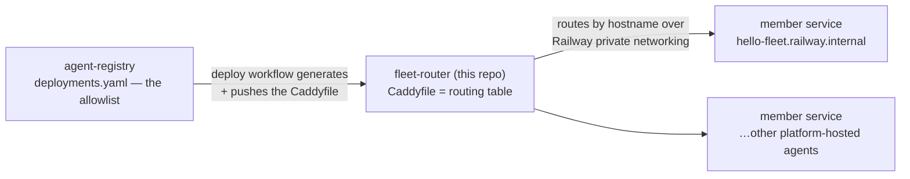

# fleet-router

> **Part of 图灵星球 Agent 军团.** New here? Start at the overview: **https://github.com/turingplanet/agent-legion**

The fleet's edge router. **One** wildcard custom domain — `*.agents.turingplanet.ai` — is attached to this single service, and Caddy forwards each hostname to the matching member service over Railway's private network (`<slug>.railway.internal`). Unknown subdomains get a 404 pointing at the docs.

That's why platform hosting needs **zero DNS work per agent**: the wildcard (plus a one-time ACME-delegation record for wildcard TLS) was configured once, and every new agent is just another line in a routing table.

## Where this fits

- **[agent-registry](https://github.com/turingplanet/agent-registry)** owns `deployments.yaml` (which agents are platform-hosted). Its `deploy-fleet` workflow regenerates the `Caddyfile` here and pushes it, then triggers a rebuild pinned to that commit.
- **Member services** are deployed by that same workflow into the platform's Railway project; this router is the only thing publicly exposed.
- **[fleet-services](https://github.com/turingplanet/fleet-services)** is the platform's other running service (AI review, registrar) — unrelated to routing, but served through here like any member.

## ⚠️ The Caddyfile is generated

Don't hand-edit it. The source of truth is `deployments.yaml` in agent-registry — edit there, and the workflow rewrites this file. A manual edit is overwritten on the next deploy run.

## Ops notes

- Member services must bind **IPv6** (`HOST=::`) or private networking can't reach them — the template's `config.py` handles this via the `HOST` env var.
- Railway builds this from the `Dockerfile` (`caddy:2-alpine` + the Caddyfile); `PORT` is injected at runtime.
- Routing changes take effect only after a rebuild — the deploy workflow triggers one explicitly, because the Caddyfile is baked into the image at build time.
